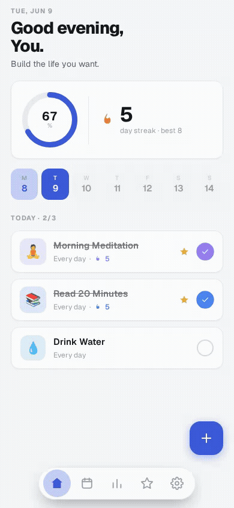
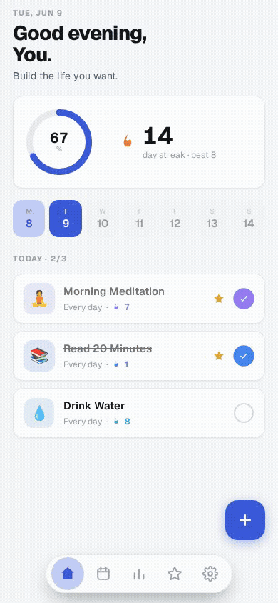
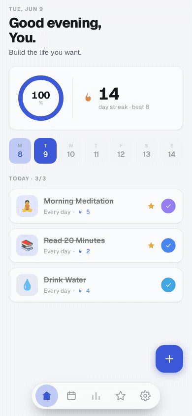
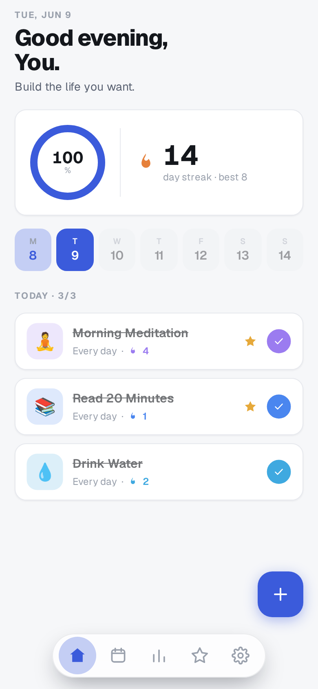
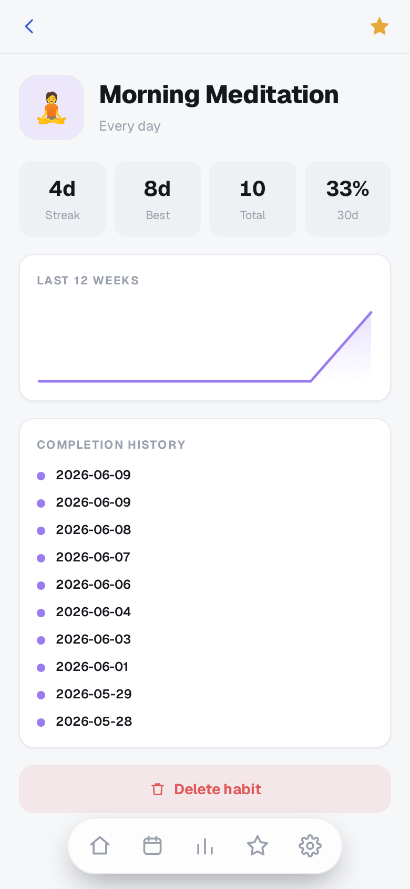
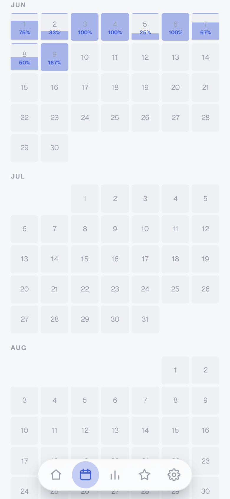
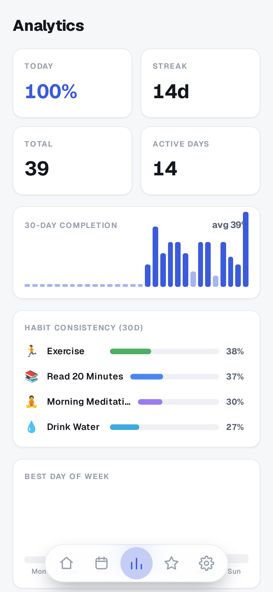

# Habitus

Mobile-first PWA for daily habit tracking. Offline-first, installable to your home screen, with an iOS-native feel on any device.

**[▶ Try the live app](https://habitus-bay.vercel.app)** — runs entirely in your browser; data is stored locally via IndexedDB, with no account or backend required.

## Features

- Today View with progress ring and week strip
- Long-press any habit to add a text note or voice memo
- Calendar heatmap across the whole year
- Streak tracking and achievement badges
- Pluggable storage: IndexedDB (default) or remote REST backend

## Demo

| Complete a habit                                               | Add a habit                                           | Notes &amp; drag-to-dismiss                                       |
| -------------------------------------------------------------- | ----------------------------------------------------- | ----------------------------------------------------------------- |
|  |  |  |

## Screens

| Today                                        | Habit detail                                    | Calendar                                            | Analytics                                             |
| -------------------------------------------- | ----------------------------------------------- | --------------------------------------------------- | ----------------------------------------------------- |
|  |  |  |  |

## Quick start

```sh
git clone https://github.com/pws-wobbuffet/habitus
cd habitus
pnpm install
bun run dev
```

Open `http://localhost:5173` in your browser or on your phone.

## Install as PWA

Open the dev (or production) URL in Safari on iOS, tap Share, then **Add to Home Screen**.

## Storage backends

Copy `.env.example` to `.env` and set `VITE_STORAGE_BACKEND`:

| Value    | Description                                     |
| -------- | ----------------------------------------------- |
| `idb`    | IndexedDB (default, offline, no server needed)  |
| `remote` | HTTP REST -- requires the `server/` Bun backend |

## Development

```sh
bun run lint        # ESLint
bun run format      # Prettier check
bun run typecheck   # tsc --noEmit
bun test            # Unit tests
bun run build       # Production build -> dist/
```

## Docs

Full documentation at [pws-wobbuffet.github.io/habitus](https://pws-wobbuffet.github.io/habitus/).

## License

MIT
